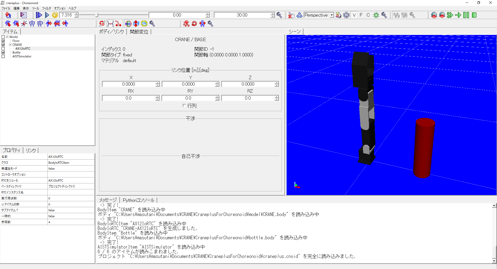
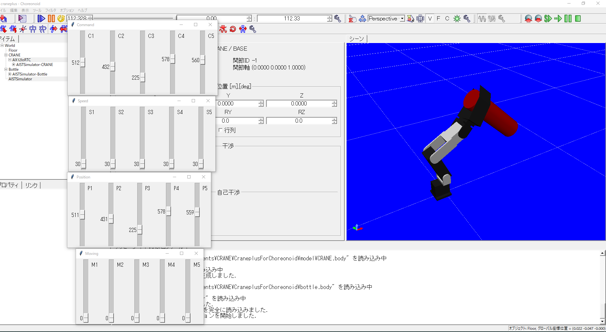
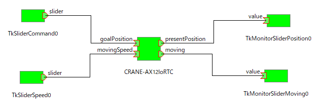

# ロボットアームCRANE+のChoreonoid用シミュレーションモデル

大阪電気通信大学  
升谷 保博  
2020年11月13日

## はじめに

- オープンソースのロボット用統合GUIソフトウェア[Choreonoid](http://choreonoid.org/ja/)を用いて，アールティ社の5軸ロボットアームCRANE+（[現在はV2](https://www.rt-shop.jp/index.php?main_page=product_info&cPath=1324&products_id=3626)）の動力学シミュレーションを行うためのモデル一式です．
- 以下の環境で開発，動作確認しています．
  - Windows 10 64bit版
  - Visual Studio 2019
  - OpenRTM-aist 1.2.1 64bit版
  - Choreonoid 1.7（OpenRTMプラグイン分離前のもの）
- VRMLモデルは名城大学の大原研究室が公開している[CRANE-simulation](https://github.com/rsdlab/CRANE-simulation)に含まれている[モデル](https://github.com/rsdlab/CRANE-simulation/tree/master/model_project/CRANE_Model)を基にしています．
- ChoreonoidのBodyIoRTCのコントローラモジュールとして使うRTCモジュール（AX12IoRTC）は独自に作成したものです．
- 以上を利用するChorenoidのプロジェクトファイルも同梱しています．

## 内容物

- ロボットと環境のVRMLモデル
  - `model/CRANE.body`， `model/*.wrl`
  - `floor.body`
  - `bottle.body`
- BodyIoRTCのRTCモジュールのソースコード
  - ディレクトリ `AX12IoRTC`
- Choreonoidのプロジェクトファイル
  - `craneplus.cnoid`
- テスト用バッチファイル, Tkを利用したスライダRTC
  - `TestCraneplus.bat`
  - `Tk*.pyw`

## インストール

- [OpenRTM-aist 1.2.1](http://www.openrtm.org/openrtm/ja/node/6034)をインストール．
- [Choreonoid 1.7をインストール](https://choreonoid.org/ja/manuals/1.7/index.html)．
  - CMakeの際にINSTALL_SDKオプションにチェックを入れること．
  - Windowsの場合，Choreonoid本体をビルドしたVisual Stduioのバージョンや構成と，ボディRTCのコントローラモジュールをビルドするVisual Stduioのバージョンや構成が異なっていると，動作しません．
- [CraneplusForChoreonoid](https://github.com/MasutaniLab/CraneplusForChoreonoid)をクローンかダウンロードする．
- CMake
  - ソースディレクトリはトップの下の`AX12IoRTC`
  - ビルドディレクトリは`AX12IoRTC/build`
  - Windowsの場合
    - ConfigureはVisual Studio 64bit
    - `AX12IoRTC/build/AX12IoRTCsln`をVisual Studioで開く．
    - 構成をReleaseにしてビルド．
    - 正常終了したら，プロジェクト`INSTALL`をビルド．
  - Linuxの場合
    - `mkdir build; cd build; cmake ..; make; make install`
  - WindowsとLinuxでプロジェクトファイルを共通にするために，コントローラモジュールの動的ライブラリ（Windowsではdllファイル，Linuxではsoファイル）を`AX12IoRTC/rtc`にインストールするようにしています．

## 使い方

- 適切なバージョンのChoreonoidを起動し，プロジェクトファイル`craneplus.cnoid`を読み込みます．
- メッセージビューにエラーが出ていないか確認します．
- `CRANE-AX12IoRTC`コンポーネントのポートを他のコンポーネントのポートに接続します．
- `CRANE-AX12IoRTC`コンポーネントの外部接続用のポートは以下の通りです．
  - 入力ポート
    - goalPosition
      - 型: RTC::TimedUShortSeq
      - 概要： 各アクチュエータへの位置指令．単位はAX-12の内部値と同じ．
    - movingSpeed
      - 型: RTC::TimedUShortSeq
      - 概要： 各アクチュエータへの速度指令．単位はAX-12の内部値と同じ．

  - 出力ポート
    - presentPosition
      - 型: RTC::TimedUShortSeq
      - 概要： 各アクチュエータの現在位置．単位はAX-12の内部値と同じ．
    - moving
      - 型: RTC::TimedUShortSeq
      - 概要： 各アクチュエータが動いているかどうかのフラグ．
- `CRANE-AX12IoRTC`のコンポーネントの仕様は，作者が公開している[Dynamixel](https://github.com/MasutaniLab/Dynamixel)コンポーネントと互換になるようにしています．
- `TestCraneplus.bat` を実行するとスライダのコンポーネントを実行し，`CRANE-AX12IoRTC`と接続して動作確認ができます．

## 既知の問題・TODO

- 位置と速度の指令に対して台形則による軌道を計算し，それに追従するようなPID制御を行っていますが，チューニングが十分ではありません．
- OpenRTMプラグイン分離について
  - [OpenRTMプラグイン分離のお知らせ](https://discourse.choreonoid.org/t/openrtm/363)